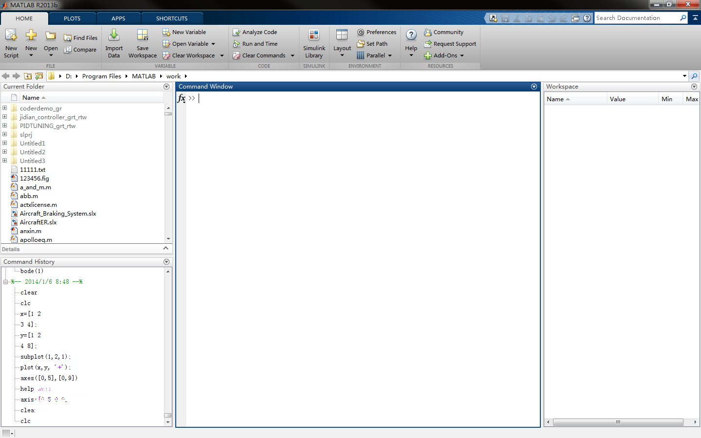

## 本文是MATLAB官网教程的学习记录笔记

#### 1.1命令

	clear 用于删除工作区变量，clc 用于清除命令行窗口。

	MATLAB 包含内置的常量，例如 pi 表示 π

	MATLAB 包含许多内置的函数，例如 abs（计算绝对值）和 eig（计算特征值）sqrt（计算平方根）。
<!--more-->
	MATLAB 变量命名为符合以下规则的任何名称：以字母开头，并且仅包含字母、数字和下划线 (_)。

	您可以使用方括号创建包含多个元素的数组。
	>> x = [3 5]
	x = 
	    3    5

	当您用空格（或逗号）分隔数值时，MATLAB 会将这些数值组合为一个行向量，行向量是一个包含一行多列的数组 (1×n)。当您用分号分隔数值时，MATLAB 会创建一个列向量 (n×1)
    >> x = [1;3]。

	您可以组合使用空格和分号来创建矩阵，即包含多行多列的数组。输入矩阵时，您必须逐行输入它们。
    >> x = [3 4 5;6 7 8]
	x = 
	    3    4    5
	    6    7    8

	在 MATLAB 中，您可以在方括号内执行计算。
    >> x = [abs(-4) 4^2]
	x = 
 	    4    16

	对于长向量，输入单个数值是不实际的。可用来创建等间距向量的替代便捷方法是使用 : 运算符并仅指定起始值和最终值：	first:last。
    >> y = 5:8
	y = 
	    5    6    7    8

	: 运算符使用默认的间距 1，但是您可以指定您自己的间距，如下所示。
    >> x = 20:2:26
	x = 
	    20    22    24    26

	如果您知道向量中所需的元素数目（而不是每个元素之间的间距），则可以改用 linspace 函数：linspace	(first,last,number_of_elements)。注意，请使用逗号 (,) 分隔 linspace 函数的输入。
    >> x = linspace(0,1,5)
	x = 
	    0    0.250    0.500    0.750    1.000

	linspace 和 : 运算符都可创建行向量。但是，您可以使用转置运算符 (') 将行向量转换为列向量。
    >> x = 1:3;
	>> x = x'
	x = 
	    1
	    2
	    3

	您可以通过在一条命令中创建行向量并将其全部转置来创建列向量。注意此处使用圆括号来指定运算的顺序。
    >> x = (1:2:5)'
	x = 
	    1
	    3
	    5

linspace
https://www.mathworks.cn/help/matlab/ref/linspace.html

3.3 数组创建函数
	
	
	许多矩阵创建函数允许您输入一个数值来创建方阵 (n×n)，或者输入两个数值来创建非方阵。
	>> x = rand(2)
	x = 
	    0.8147    0.1270
 	   0.9058    0.9134    
	>> x = rand(2,3)
	x = 
	    0.6324    0.2785    0.9575
	    0.0975    0.5469    0.9649

4.1 保存和加载变量

	您可以使用 save 命令将工作区中的变量保存到称为 MAT 文件的 MATLAB 特定格式文件中。
	  >> save foo x
	以上命令将名为 x 的变量保存到名为 foo.mat 的 MAT 文件中。
	
	您可以使用 load 命令从 MAT 文件加载变量。
	>> load foo
	
附加资源：保存、加载和删除工作区变量 
https://www.mathworks.cn/help/matlab/matlab_env/save-load-and-delete-workspace-variables.html
	

5.1 对数组进行索引

	您可以使用行、列索引从数组中提取值。
	>> x = A(5,7);
	此语法将会提取 A 的第 5 行第 7 列的值，然后将结果赋给变量 x。	
	
	
	您可以使用 MATLAB 关键字 end，作为行或列索引来引用最后一个元素。
	>> x = A(end,2);
	
	请注意，您可以将算术运算与关键字 end 结合使用。例如：
	>> x = A(end-1,end-2)
	

5.2 提取多个元素

	用作索引时，冒号运算符 (:) 可指代该维度中的所有元素。以下语法
	>> x = A(2,:)
	会创建一个包含 A 中第 2 行上所有元素的行向量。

	冒号运算符可以引用某个值范围。以下语法会创建一个包含矩阵 A 的第 1 行、第 2 行和第 3 行所有元素的矩阵。
	>> x = A(1:3,:)

	单个索引值可用于引用向量元素。例如，以下语句
	>> x = v(3)
	会返回向量 v 的第 3 个元素（当 v 为行向量或列向量时）。

	单个索引值范围可用于引用向量元素的子集。例如 
	>> x = v(3:end)
	返回向量 v 的一个子集，其中包含从第三个到最后一个元素范围内的所有元素

附加资源：矩阵索引 | 数组索引
https://www.mathworks.cn/help/matlab/math/array-indexing.html
https://www.mathworks.com/help/matlab/learn_matlab/array-indexing.html

5.3 更改数组中的值

	记住您可以使用 : 字符来提取整列数据。

	可以通过组合使用索引与赋值来修改变量的元素。
	A(2,5) = 11
	将 data 的第一行最后一列的值更改为 0.5。
	>>data(1,end)=0.5

6.1 执行数组运算

	MATLAB 的设计让您能够自然地处理数组。例如，您可以将一个标量值与数组中的所有元素相加。
	>> y = x + 2

	您可以将任意两个大小相同的数组相加。
	>> z = x + y

	您可以将数组中的所有元素与某个标量相乘或相除。
	>> z = 2*x
	>> y = x/3

	MATLAB 中的基本统计函数可应用于某个向量以生成单个输出。可以使用 max 函数来确定向量的最大值。
	>> xMax = max(x)

	MATLAB 的函数可在单个命令中对整个向量或值数组执行数学运算。
	>> xSqrt = sqrt(x)
	使用 round 函数创建一个名为 vr 的变量，其中包含四舍五入为整数的平均体积 va
	vr=round(va)

	* 运算符执行矩阵乘法。因此，如果您使用 * 将两个大小相同的向量相乘，则由于内部维度不一致，您将会收到一条错误消息。
	>> z = [3 4] * [10 20]
	用于矩阵乘法的维度不正确。请检查并确保第一个矩阵中的列数与第二个矩阵中的行数匹配。要执行按元素相乘，请使用 '.*'。
	而 .* 运算符执行按元素乘法，允许您将两个大小相同的数组的对应元素相乘。
	>> z = [3 4] .* [10 20]
	z = 
	    30    80

附加资源：数组与矩阵运算
https://ww2.mathworks.cn/help/matlab/matlab_prog/array-vs-matrix-operations.html

7.1 从函数调用获取多个输出

	size 函数可以应用于数组，以生成包含数组大小的单个输出变量。
	>> s = size(x)

	size 函数可以应用于矩阵，以生成单个输出变量或两个输出变量。使用方括号 ([ ]) 获取多个输出。
	>> [xrow,xcol] = size(x)

	可以使用 max 函数确定向量的最大值及其对应的索引值。max 函数的第一个输出为输入向量的最大值。执行带两个输出的调用时，第二个输出为索引值。
	>> [xMax,idx] = max(x)

9.1 绘制向量图

	可以使用 plot 函数在一张图上绘制两个相同长度的向量。
	>> plot(x,y)

	plot 函数接受一个附加参数，该参数让您能够在单引号中使用各种符号来指定颜色、线型和标记样式。
	>> plot(x,y,'r--o')
	以上命令将会绘制一条红色 (r) 虚线 (--)，并使用圆圈 (o) 作为标记。您可以在线条设定的文档中了解有关可用符号的详细信息。https://ww2.mathworks.cn/help/matlab/ref/linespec.html

	您会注意到，最开始创建的绘图消失了。要在一张图上先后绘制两条线，请使用 hold on 命令保留之前的绘图，然后添加另一条线。您也可以使用 hold off 命令返回到默认行为。

	close all 命令以关闭所有打开的图窗窗口。

	当您单独绘制一个向量时，MATLAB 会使用向量值作为 y 轴数据，并将 x 轴数据的范围设置为从 1 到 n（向量中的元素数目）。

	plot 函数接受可选的附加输入，这些输入由一个属性名称和一个关联的值组成。
	>> plot(y,'LineWidth',5)
	以上命令将绘制一条粗线。您可以在 Line 属性文档中了解更多可用属性的详细信息。
https://www.mathworks.com/help/matlab/ref/matlab.graphics.chart.primitive.line-properties.html
	
9.2 编写绘图注释

	可以使用绘图注释函数（例如 title）在绘图中添加标签。这些函数的输入是一个字符串。MATLAB 中的字符串是用单引号 (') 引起来的。
	>> title('Plot Title')	

	使用 ylabel 函数添加y轴标签

