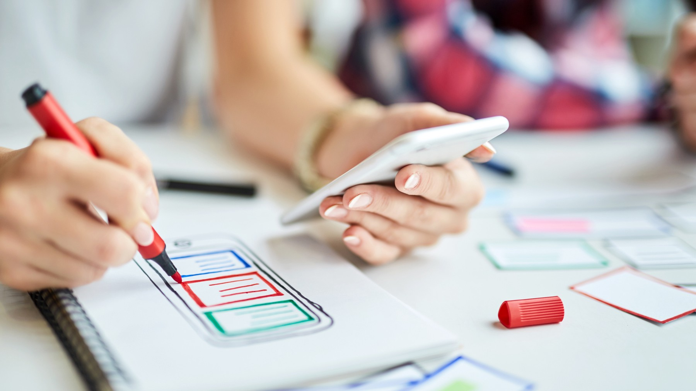

<h1> 从 ui / ux 设计师到产品设计师的演变</h1>

> 本文来自阅读极客时间专栏《左耳听风》89 | 程序员练级攻略：UI/UX设计 文章中的推荐阅读

- 原文链接：https://medium.com/thinking-design/the-evolution-of-ui-ux-designers-into-product-designers-623e4e7eaab3
- 作者：Adobe Creative Cloud
- 2017年1月18日

What is a product? Until recently, the term was only used in relation to something material and often found in a retail store, but nowadays it is coming to mean digital products as well. Apps are modern products.

什么是产品？ 直到最近，这个词还只是用来指物质的东西，通常在零售店里才能找到，但是现在它也开始指数字产品了。 应用程序是现代产品。

<!--more-->

When it comes to building great products, design is the most important “feature.” We’ve moved into the stage where product design dominates — it’s what sets companies apart and gives a real edge over competitors.

当谈到建立伟大的产品，设计是最重要的“特征。” 我们已经进入了产品设计占主导地位的阶段ーー这是公司与众不同的地方，也是相对于竞争对手的真正优势所在。

The design industry has evolved quite a lot in the last few years and today there are a number of different responsibilities encompassed by the umbrella term designer: UX Designers, UI Designers, and Product Designers. “What is the difference between these job roles?” is a fairly common question in design industry. Let’s attempt to distill what each of these titles really mean, and look at why the evolution of UI/UX Designers into Product Designers is a logical development in the era of modern technology.

在过去的几年里，设计行业已经发生了很大的变化，如今，设计师这个总称涵盖了许多不同的职责: 用户体验设计师、用户界面设计师和产品设计师。 “这些工作角色之间的区别是什么? ” 在设计行业是一个相当普遍的问题。 让我们尝试提炼出每一个标题的真正含义，并且看看为什么 ui / ux 设计师进化成产品设计师是现代技术时代的一个合乎逻辑的发展。

## UX, UI, Product: Who Does What?

## 用户体验，用户界面，产品: 谁做了什么？

All of these roles have one thing in common — they all design how a user interacts with a product. But these people all perform slightly different functions to reach the same goal.

所有这些角色都有一个共同点: 他们都设计用户如何与产品交互。 但是这些人为了达到同一个目标，所执行的功能略有不同。

### UX Designer (User Experience Designer)

### 用户体验设计师

UX designers are primarily concerned with how the product feels. The goal is make the user’s interaction as efficient and simple as possible. UX designers look at design from the mindspace of a user and squash potential problems by:

用户体验设计师主要关心的是产品的感觉。 我们的目标是让用户的交互尽可能的高效和简单。 用户体验设计师从用户的思维空间来看待设计，通过以下方式来消除潜在的问题:

- Writing various product user scenarios and building patterns of interaction. 
- 编写各种产品用户场景和构建交互模式

- Resorting to various kinds of testing and watching what users do (e.g. usability-lab studies, eye-tracking, A/B testing, email surveys, etc). 
- 通过各种测试和观察用户的行为(例如: 可用性实验室研究、眼球追踪、 a / b 测试、电子邮件调查等)

- Prototyping an interface and creating the products logic via wireframes. 
- 原型化界面并通过线框图创建产品逻辑

### UI Designer (User Interface Designer)
### Ui 设计师(用户界面设计师)

UI designers, on the other hand are the people who are primarily concerned how the product looks. They responsible for how we see the product in its final version. They are in charge of designing each screen or page with which a user interacts and ensuring that the user interface visually communicates the logic that a UX designer has offered (for example, a UI designer creating a data dashboard can front load the most important content at the top). UI designers are also responsible for creating a style guide and unified visual language that is applied across the product.

另一方面，UI 设计师主要关心的是产品的外观。 他们负责我们如何看待产品的最终版本。 他们负责设计用户交互的每个屏幕或页面，并确保用户界面可视化地传达用户体验设计师提供的逻辑(例如，创建数据指示板的用户界面设计师可以在顶部前端加载最重要的内容)。 Ui 设计师还负责创建一个样式指南和统一的视觉语言，应用于整个产品。

### Product Designer
### 产品设计师

Product Designer is a sum-up term used to describe a designer who is generally involved in the creation of the look and feel of a whole product. Many product designers consider themselves to be designers who design experiences. This means that a product designer is the one who gives real insight to UX and UI designers when it comes to how certain features should work, or how a certain UI control should look.

产品设计师是一个总结术语，用来描述一个设计师，他通常参与创造整个产品的外观和感觉。 许多产品设计师认为自己是有设计经验的设计师。 这意味着产品设计师是那个在特定功能应该如何工作，或者特定 UI 控件应该如何外观方面给用户体验和用户界面设计师提供真正见解的人。

Companies use the term ‘Product Designer’ differently; the most general definition is a person who’s a champion of a user’s needs. As Justin Edmund said, “A product designer oversees product vision from a high level (how does this feature make sense for where we want to be in 6 months) to a low execution level (how does styling this button this way impact how the user flows through this function).”

公司使用“产品设计师”这个术语的方式不同; 最普遍的定义是一个能够满足用户需求的人。 正如 Justin Edmund 所说，“产品设计师监督产品远景，从高层次(这个功能对我们6个月后的目标有什么意义)到低层次的执行(这样设计这个按钮如何影响用户通过这个功能的流程)。”

## Drivers of Design Evolution
## 设计进化的驱动力

Design and its component practices are like any other craft: you can always develop a deeper familiarity with the minutiae and master your skills by taking more active role in whole design process. There’s a general positive trend of designers taking on a larger scope of responsibilities within the product development process, and here are some drivers for this trend:

设计及其组件实践就像其他工艺一样: 你总是可以通过在整个设计过程中扮演更积极的角色，对细节有更深入的了解，并掌握自己的技能。 设计师在产品开发过程中承担更大范围的责任，这是一个普遍的积极趋势，以下是这一趋势的一些驱动因素:

### Design Thinking

### 设计思维

Design thinking has become a popular approach for designing a product. The best design reflects the product’s goals. Good designers have always applied design thinking to product design, whether physical or digital, because it’s focussed on end-to-end product development, not just the “design phase” part.

设计思维已经成为一种流行的产品设计方法。 最好的设计反映了产品的目标。 优秀的设计师总是将设计思维应用到产品设计中，无论是物理设计还是数字设计，因为他们关注的是端到端的产品开发，而不仅仅是“设计阶段”。

When thinking in products, designers should understand business objectives and be able to answer the following questions first:

在思考产品时，设计师应该理解商业目标，并能够首先回答以下问题:

- What problem do we solve? 我们要解决什么问题？
- Who has these problems? 谁有这些问题？
- Why are we doing this? 我们为什么要这么做？
- How are we doing this? 我们要怎么做？
- What do we want to achieve? 我们想要实现什么？

Answering these questions helps designers understand the user experience of a product as a whole; not purely as interaction (feel) or visual (look) design part. Only after that it makes sense to move to the actual state offinding a design solution which includes following 6 phases:

回答这些问题可以帮助设计师理解整个产品的用户体验，而不仅仅是交互(感觉)或视觉(外观)设计部分。 只有在这之后，才有意义转移到实际状态，提出一个包括以下6个阶段的设计方案:

- Empathize: Conduct research to develop a deeper understanding of your users. 
- 感同身受: 进行研究，深入了解你的用户

- Define: Combine your research and observe where your users’ problem exist. In pinpointing your users’ needs, begin to highlight opportunities for innovation. 
- 定义: 结合你的研究，观察用户存在问题的地方。 在精确定位用户的需求时，开始强调创新的机会

- Ideate: Generate a range of potential solutions by giving yourself and your team total freedom. 
- 想法: 通过给你自己和你的团队完全的自由来产生一系列可能的解决方案

- Prototype: Build a prototype (or series of prototypes) to test your solution. Creating a prototype lets designer see if they’re on the right track, and often sparks different ideas that wouldn’t come in other cases. 
- Prototype: 构建一个原型(或一系列原型)来测试您的解决方案。 创建一个原型让设计师看看他们是否在正确的轨道上，并经常会激发不同的想法，不会出现在其他情况下

- Test: Return to your users for feedback. Ask yourself ‘Does this solution meet users’ needs?’ 
- 测试: 返回给你的用户以获得反馈。 问问自己这个解决方案是否满足用户的需求

- Implement” Put the vision into effect. Ensure that your solution is materialized and works for your users. This step is crucial for the entire process. 
- 实施”把愿景付诸实施。 确保您的解决方案是具体化的，并且对用户有效。 这一步对整个过程至关重要

### Collaborative Work
### 协同工作

More and more companies try to unify designers and developers into the development process. This new way of product development has two major benefits:

越来越多的公司试图将设计师和开发人员统一到开发过程中。 这种新的产品开发方式有两个主要好处:

Working together in a collaborative environment creates a situation where team members are encouraged to think wildly. Also embracing the critique of a whole team is the best way to refine something that, if designed in isolation, is at risk of becoming impossible to use. 

在一个协作的环境中共同工作创造了一种鼓励团队成员广泛思考的情况。 接受整个团队的批评也是改进某些东西的最好方法，如果单独设计，就有变得不可能使用的风险

Methodologies such as Agile and Lean leads to designers and other team members working more cross-functionally with larger scopes of responsibility. 方法论，例如敏捷及倾斜导致设计师和其他团队成员在更大的职责范围内跨职能地工作

### Continuous Improvement (Iterative Design)

### 持续改进(迭代设计)

Unlike more traditional forms of design, design process for digital products isn’t a one-time thing and designers should never assume to get everything right on the first go. Implementation often reveals gaps in the design: undocumented conditions or bad assumptions about product usage, which hard to predict without shipping the product.

与传统的设计形式不同，数字产品的设计过程不是一次性的，设计师永远不应该假设一开始就把每件事都做对。 实现往往会揭示设计中的差距: 没有记录的条件或关于产品使用的错误假设，如果没有运输产品，就很难预测。

To design a successful product you need to adopt a process of continuous improvement. Iterative design follows the idea that design should be done in repeated cycles: it’s a process of constantly refining and improving the product based on both qualitative and quantitative feedback data from your users. This is a great opportunity for designers to see a bigger picture, improve their work based on user feedback and make the product inherently more valuable to the user.

为了设计一个成功的产品，你需要采用一个持续改进的过程。 迭代设计遵循的思想是设计应该在重复的循环中进行: 它是一个不断地改进和提高产品的过程，这个过程基于来自用户的定性和定量的反馈数据。 对于设计师来说，这是一个很好的机会，他们可以看到更大的图景，根据用户的反馈改进他们的工作，使产品对用户来说更有价值。

## Conclusion
## 总结

Product design represents the next enlargement of design scope, from just user experience design towards an even broader state of design for an entire product.

产品设计代表了下一次设计范围的扩大，从单纯的用户体验设计到更广泛的整个产品设计状态。

The best products are built by people who understand the whole product, not just their silo. In order to make such products, UI/UX Designers should look to evolve into Product Designers who are able to generate and process a additional information to get the best result.

最好的产品是由了解整个产品的人创造的，而不仅仅是他们自己的筒仓。 为了制造这样的产品，ui / ux 设计师应该考虑发展成为能够生成和处理附加信息以获得最佳结果的产品设计师。

